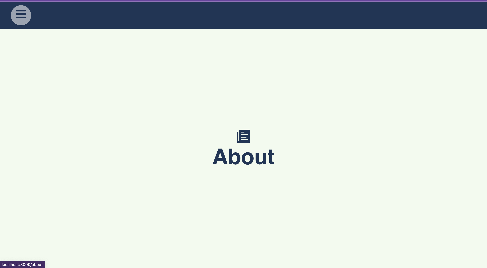

# react-hamburger-menu

---

### :writing_hand:

> A React.js project 

# Getting Started with Clone Project
> Step 1 => Firstly, Clone this project from the respository

> Step 2 => npm install

> Step 3 => npm start (or) yarn start

#  This project result step by step, you can find out below the photo.

  

 
 

  

 

  

-----------------------------------------------------------------------------------------------------------------------

# Getting Started with Create React App

This project was bootstrapped with [Create React App](https://github.com/facebook/create-react-app).

## Available Scripts

In the project directory, you can run:

### `npm start`

Runs the app in the development mode.\
Open [http://localhost:3000](http://localhost:3000) to view it in your browser.

The page will reload when you make changes.\
You may also see any lint errors in the console.

## Learn More

You can learn more in the [Create React App documentation](https://facebook.github.io/create-react-app/docs/getting-started).

To learn React, check out the [React documentation](https://reactjs.org/).

